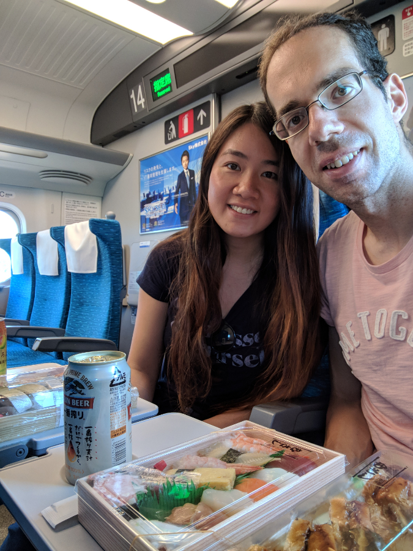

<ul>
  <li class='lightbox_thumbnail'>
    
  </li>

  <li class='lightbox_thumbnail'>
    
  </li>

  <li class='lightbox_thumbnail'>
    
  </li>

  <li class='lightbox_thumbnail'>
    
  </li>

  <li class='lightbox_thumbnail'>
    
  </li>

  <li class='lightbox_thumbnail'>
    
  </li>

  <li class='lightbox_thumbnail'>
    
  </li>
</ul>
